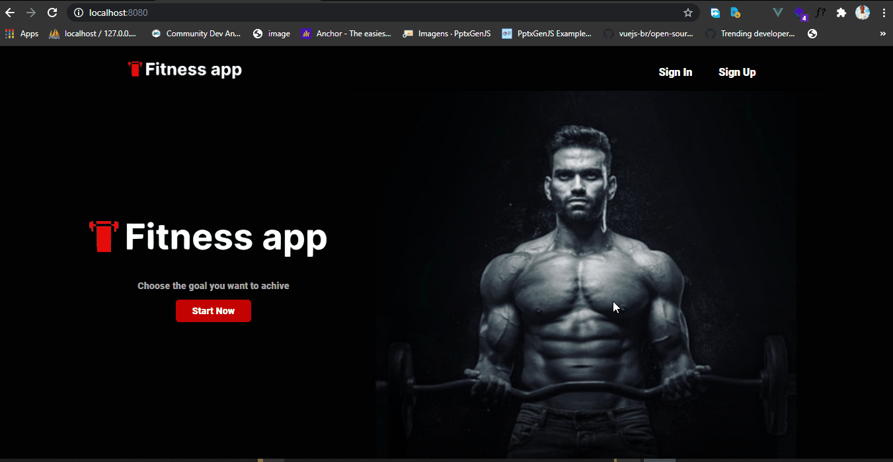

# Fintness app

Fala Vue js developers 😊😊😊😱😱🎉🎉🎉🎉, então durante este fim de semana fiquei pensando um projeto para portofolio, só mesmo para treinamento, então pedi para um amigo, desenhar uma tela sobre esta aplicação ai, "Fitness-app" então o app fiz todo do zero, a ideia é terminar ele até o back end em node js.
ainda está em desenvolvimento

 **[Testar o beta](https://rocketseat.com.br/)**

 <h1 align = center>
    
</h1>

## 📚 Páginas
O site é composto por 4 diferentes páginas: 

  - **Página de Home:** Essa página é uma tela inicial sobre o app;
  - **Página de login :** Está pagina é serve para usuario fizerem   
  - **Página de cadastro:** Está pagina é a pagina para cadastramento de usuario. 
  - **dashboard:** Esta é uma página de dashboard de usuario, onde usuario poderá ver todas as estatistica sobre o treinamento

  OBS: Esta pagina de dashboard ainda não protege no front, então podes acessar com "/dashboard" mesmo 

  ## 💻 Tecnologias utilizadas
  - Vue js
  - Css flexbox

obs.: Para o funcionamento Do projecto deves configurar seguindo os seguintes pasos: 
#Project setup

--yarn install

#Compiles and hot-reloads for development

--yarn serve

#Compiles and minifies for production

---yarn build

#Lints and fixes files

--yarn lint

para mais info: visite o site do vue js  **[Vue js](https://br.vuejs.org/v2/guide/)**

🐱‍👤 Desenvolvido por <strong>Lázaro Inácio Manuel</strong>   -----   Me adicione no <a href="https://www.linkedin.com/in/l%C3%A1zaro-in%C3%A1cio-manuel-9264971b3/"target="_blank">Linkedin</a>

